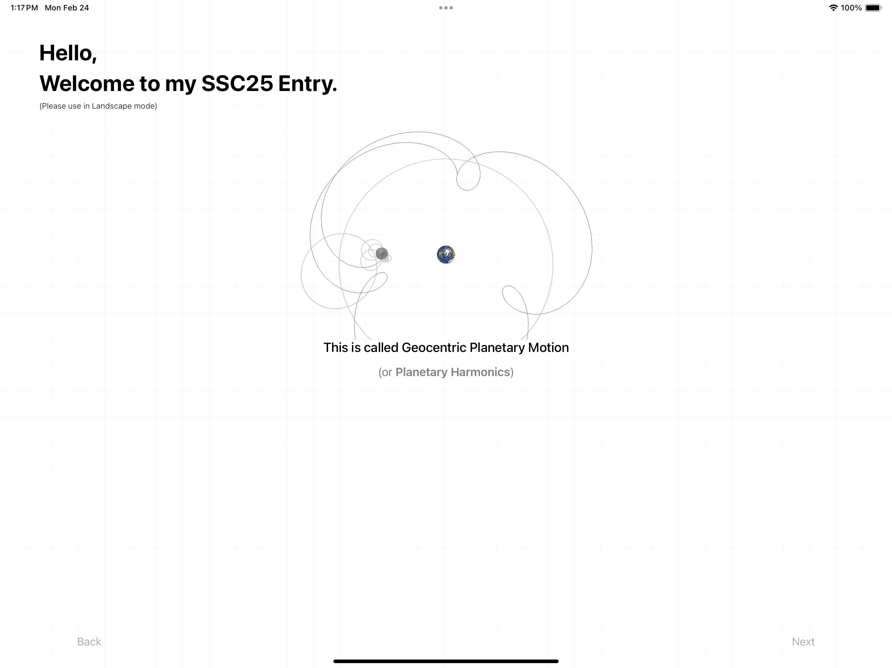
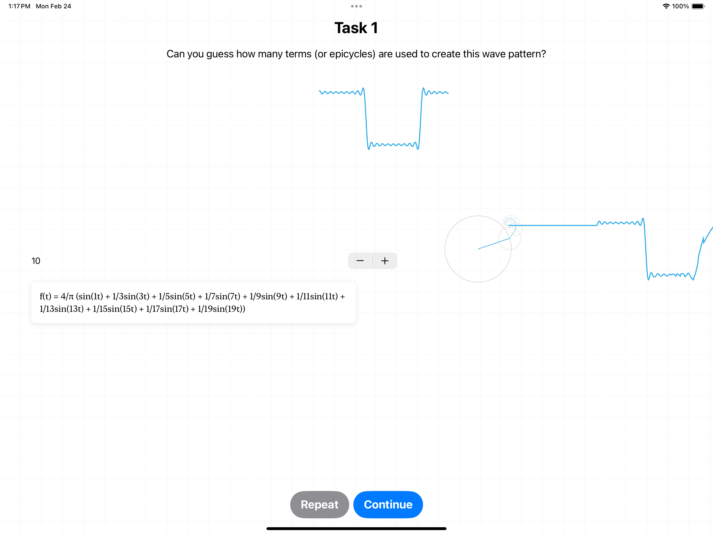

# Armillary
 Swift Student Challenge 2025

Visualizing geocentric planetary movement with signal processing. Along with interactive explanation of Fourier Analysis.

<video src="https://github.com/user-attachments/assets/aef25e27-4920-42cc-adb4-e3da19d8271a" controls="controls"></video>

  
  
  
  
  

## Technologies Used
- SwiftUI
- SceneKit

Planet coordinates: [Horizon](https://github.com/0xdbug/Horizon)

Textures: [Solar Textures](https://www.solarsystemscope.com/textures/)

